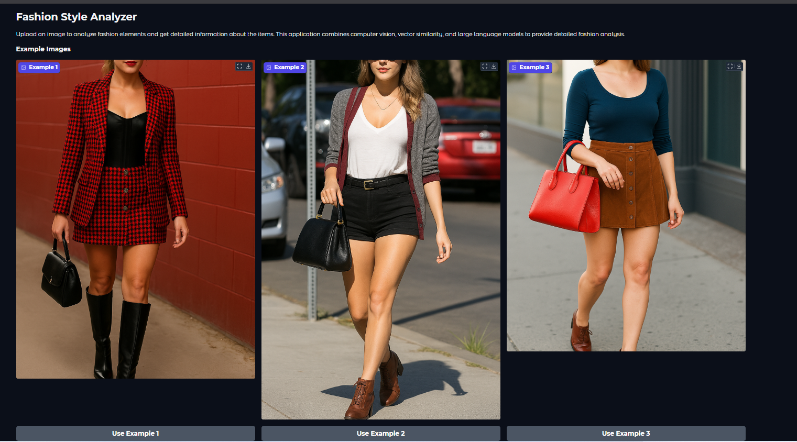

## Style Finder Application

The Style Finder is an advanced computer vision application that leverages deep learning to analyze fashion elements in images. Using Meta's Llama 3.2 90B Vision Instruct model, this system identifies clothing items, retrieves relevant metadata, and provides actionable insights based on visual inputs.

Upload any fashion photo, and Style Finder will identify garments, analyze their style elements, and provide detailed information about each item. It can also find similar items at different price points, making high-end fashion more accessible.

With the dataset based on Taylor Swift's iconic outfits, the system demonstrates how to connect visual inputs with structured fashion data for precise identification of garments, accessories, and styling elements with corresponding commercial availability information.

## Applications Architecture

## Applications Images

---

---

---

---

---